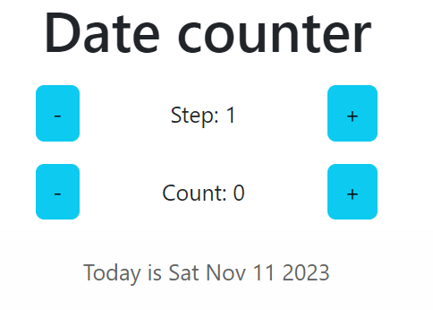

# Getting Started

### `npm i`

### `npm start`

We have current date as initial value. Count can change date to future from now
and in to past from now. Step is value that will take for each count press.